Lifetime learner on a journey of discovery :cloud_with_lightning::hamster:

My favourite tech stack is: [Google Cloud Platform], [Kubernetes], [Terraform], [Docker], [openSUSE] and [Ubuntu] Linux, [Go], [Git], and [Python].

I have a soft spot for modern [ARM] microcontrollers as well... 😅

[Google Cloud Platform]: https://cloud.google.com/
[Kubernetes]: https://kubernetes.io/
[Terraform]: https://www.terraform.io/
[openSUSE]: https://www.opensuse.org/
[Ubuntu]: https://ubuntu.com/
[Go]: https://golang.org/
[Git]: https://git-scm.com/
[Python]: https://www.python.org/
[Docker]: https://www.docker.com/
[ARM]: https://www.arm.com/

I give talks occasionally: [Keep your head in the Clouds](https://gdsc.community.dev/events/details/developer-student-clubs-university-of-novi-sad-presents-keep-your-head-in-the-clouds/)

## Certified

[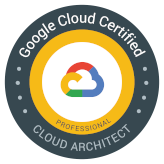](https://www.credential.net/a1b633aa-914a-485d-8520-b4d41c3d7803) &emsp;
[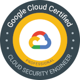](https://www.credential.net/d1408d56-7401-49b7-96e1-0a695a364114) &emsp;
[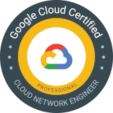](https://www.credential.net/e9ffc93b-2f1e-4fa2-a2b5-9411d2635574) &emsp;

[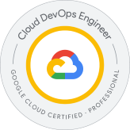](https://www.credential.net/46cba05c-02c0-48eb-8e2c-90b4e5d690be) &emsp;
[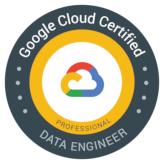](https://www.credential.net/99a4cf49-7d07-411b-af08-15c1589eb59c) &emsp;
[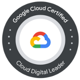](https://www.credential.net/ed191d47-b467-46d7-aef0-9f245dc43829) &emsp;
[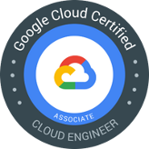](https://www.credential.net/e86d5bfb-a57e-49ec-9132-1b0f8e7c08cf) &emsp;

[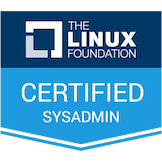](https://www.credly.com/badges/0a0f01ba-a2f4-400f-946b-e14735c26aa6) &emsp;
 &emsp;
[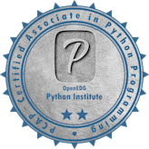](https://www.youracclaim.com/badges/1f7ce0ee-2597-4ad1-bad2-968c6551f66a/public_url) &emsp;

## Professional development

[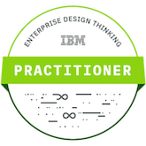](https://www.youracclaim.com/badges/77b0ccdd-8793-499d-94c8-69a9a2b717b8/public_url) &emsp;
[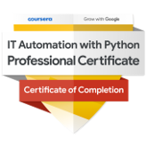](https://www.youracclaim.com/badges/e089c085-dad2-4344-b42e-78269eae8d07/public_url)
